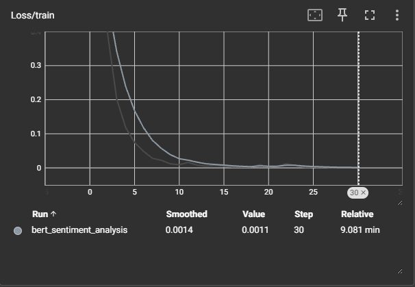
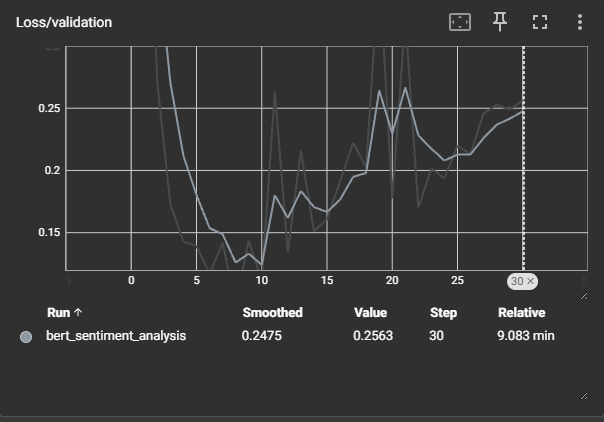
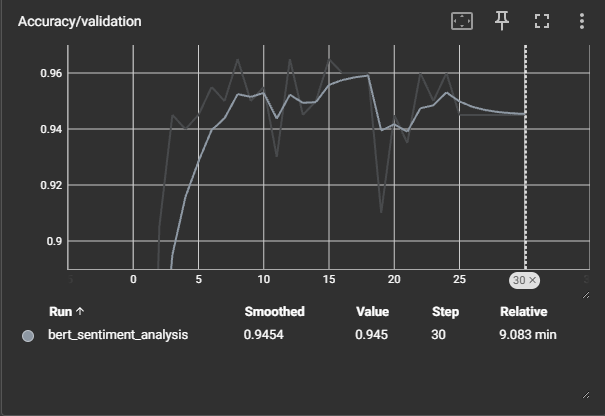

# Sentiment Analysis API using Fine-tuned BERT

This repository contains the code for fine-tuning a BERT model on a sentiment analysis task and serving it via a Flask API for inference. It also includes instructions for setting up the environment, training the model, evaluating it using TensorBoard, and using the API to perform inference on text reviews.

## 1. Installation

### Prerequisites

- Install [Anaconda](https://www.anaconda.com/products/distribution) (recommended for environment management)
- Python 3.8+ (Suggest Python 3.11 personally)

### Setup Instructions

1. Clone this repository:

    ```bash
    git clone https://github.com/William-Yao0993/T-War.git
    cd T-War
    ```

2. Create a conda environment and install the necessary dependencies:

    ```bash
    conda env create -f environment.yml
    conda activate T-WAR
    ```
3. Download the models from this link (Github cannot hold since the models are larger than 100mb) `https://anu365-my.sharepoint.com/:f:/r/personal/u6771897_anu_edu_au/Documents/Twar?csf=1&web=1&e=epexGW` and put `models` folder under `T-War` repo.

## 2. Usage

We use the Flask app to serve it for inference:

1. Start the Flask API:

    ```bash
    python app.py
    ```

2. The Flask app will start on `http://127.0.0.1:5000/predict`. You can make predictions by sending a POST request with a review in JSON format.

    **Example using `curl`:**
    #### **For Windows**:
    ```bash
    curl -X POST http://127.0.0.1:5000/predict -H "Content-Type: application/json" -d "{\"review\": \"The product was great!\"}"
    ```

    #### **For Linux/MacOS/WSL**:
    ```bash
    curl -X POST http://127.0.0.1:5000/predict -H "Content-Type: application/json" -d '{"review": "The product was great!"}'
    ```
    **Expected response:**

    ```json
    {
        "sentiment": "positive"
    }
    ```

## 3. Model Training
3. Ensure the dataset is present in the `Dataset/` directory (Restaurant_Reviews.tsv).

4. Run the training script to fine-tune the BERT model:

    ```bash
    python train.py
    ```

    This will start training and save the best model under the `models/` directory.

## 4. Model Evaluation Graph 

1. To visualize the training and validation metrics, use TensorBoard:

    ```bash
    tensorboard --logdir=runs
    ```

### Training Loss


- **Training Loss**: The training loss continuously decreased across all epochs, which shows that the model was successfully learning from the training data.
- By the final epoch, the training loss was around **0.0011**, indicating a very strong fit to the training data.

### Validation Loss


- **Validation Loss**: The validation loss decreased in the initial epochs, hitting a low point around epoch 10. However, the graph shows an increase after epoch 20, signaling **overfitting**—the model started performing better on training data but worse on unseen validation data.

### Validation Accuracy


- **Best Validation Accuracy**: The best validation accuracy achieved was around **96%** at approximately epoch 18.
- The graph shows that after epoch 15, validation accuracy plateaued and even fluctuated slightly, indicating that the model was reaching its peak performance.

### Key Observations:
- **Overfitting**: Around epoch 20, validation loss began to increase while validation accuracy started to fluctuate, indicating signs of overfitting.
- **Model Saving**
Regardless the overfitting arise during training, I implemented a way in `train.py` that the model will only be saved with the best performance.